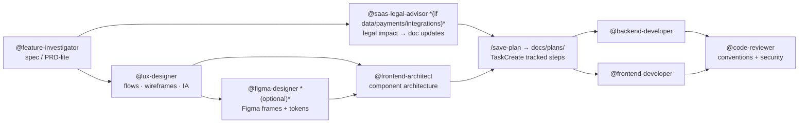

# addit-harness


A coding agent's out-of-the-box config is a blank slate. **addit-harness** is the config harness that turns it into a **full digital product development kit** — covering every layer from idea to ship: legal compliance, UX design, architecture, implementation in Go · Java · TypeScript, and code review, all wired into a plan→verify→commit engineering loop. One-line install, auto-detecting whichever agent(s) you have. Philosophy: curate established assets and adapt them — don't hand-roll what already exists.

---

A shared configuration that covers the full digital product development loop —
from idea investigation and legal compliance through UX design,
backend/frontend architecture, and implementation in Go · Java/Spring ·
TypeScript (Bun backend · React/Next.js frontend), to code review and
debugging — synced into [Claude Code](https://code.claude.com),
[Cursor](https://cursor.com), [Codex CLI](https://developers.openai.com/codex),
and [Kiro](https://kiro.dev). See [*Other coding agents*](#other-coding-agents)
for what's covered per tool (GitHub Copilot support is planned, not yet
implemented — see *Roadmap*).
Built for **SaaS founders and product engineers** who own the full feature
lifecycle and want every layer of that loop to have an opinionated, specialized
subagent behind it.

**Philosophy:** adopt established, well-known assets (the official plugin
marketplace + reputable community collections) and adapt/pin them — don't
hand-roll what already exists. The repo is a thin **curation + config layer**, not
a pile of bespoke skills. It deliberately reuses Claude Code's built-ins
(`/code-review`, `/simplify`, `/verify`, `/run`, `/init`, `deep-research`).

## Why this config?

**Without it:** Claude Code starts as a blank slate — no engineering loop, no conventions, no subagents. You either wing it session to session or spend hours wiring up memory, rules, and delegation yourself, then rebuild it on every machine.

**With it:** one command gives you a reproducible, opinionated starting point:

| | Blank slate | This config |
|---|---|---|
| Engineering process | Ad-hoc | plan→verify→commit loop baked in |
| Legal compliance | Manual check (or skipped) before shipping | `@saas-legal-advisor` assesses impact of every feature change; drafts/reviews T&C, Privacy Policy, cookie policies, DPAs |
| Language conventions | Manual context injection every session | Auto-load per file type (Go · Java · TS) |
| Code review | Ask Claude to review | `@code-reviewer` enforces the conventions with file:line citations |
| Complex work | Monolithic context | Delegate to specialized subagents; main context stays clean |
| UX & design | Describe and hope | `@ux-designer` → `@figma-designer` → `@frontend-architect` pipeline |
| New machine | Redo everything | `./install.sh` |

## Install

### Claude Code

No clone, no shell script — install the plugin from inside Claude Code:

```
/plugin marketplace add addit-digital/addit-harness
/plugin install addit-harness@addit
/addit-harness:setup
```

- The plugin (`agents/`, `skills/`) tracks this repo via git automatically —
  no re-run needed to pick up updates.
- `/addit-harness:setup` places the parts a plugin can't carry natively
  (`CLAUDE.md`, `AGENTS.md`, `rules/`, `references/`, `settings.json`) — run
  it once after installing, and again after an update to re-sync. Add
  `--scope project` to confine it to the current project instead of
  `~/.claude` (default), or `--link` to symlink instead of copy.
- The plugin itself can also be scoped: `/plugin install
  addit-harness@addit --scope local` keeps it to just the current repo;
  `--scope project` shares it with collaborators via that repo's
  `.claude/settings.json`; default `--scope user` is global.
- Plugin-provided agents are namespaced — invoke them as
  `@addit-harness:code-reviewer`, not bare `@code-reviewer`.
- Prefer the old copy-based install instead? `./install.sh --target claude`
  still works (see below) — it's no longer run automatically by
  `./install.sh` with no arguments.

### Cursor / Kiro / Codex CLI

```bash
git clone <this-repo> ~/src/addit-harness && cd ~/src/addit-harness
./install.sh              # auto-detect: sync every supported agent found on this machine
./install.sh --target X   # force one: claude|cursor|kiro|codex (copilot: see Roadmap)
./install.sh --link       # symlink instead of copy, so edits track git
./install.sh --plugins    # claude only: also register marketplaces + install official plugins
```

`install.sh` checks each tool's CLI on `PATH` or home directory (`~/.cursor`,
`~/.kiro`, `~/.codex`) and syncs config into whichever it finds. It merges
per-file into each tool's home, never clobbering the whole directory, so
`projects/`, history, and existing hooks are preserved. Re-running backs up
anything it replaces to `<tool-home>/.install-backups/<timestamp>/`.

Claude Code has its own plugin-based install above and is no longer synced by
a plain `./install.sh` run; `--target claude` still works if you'd rather use
the copy-based path (backs up and replaces `~/.claude/settings.json` too —
merge any custom permissions/hooks back from the backup).

## What's in here

| Path | What | How it's sourced |
|------|------|------------------|
| `AGENTS.md` | Canonical, tool-neutral global memory: operating model + hard rules. Every tool's baseline is generated from this file (see *Other coding agents*) | Authored; follows [Anthropic memory](https://code.claude.com/docs/en/memory) & [best-practices](https://www.anthropic.com/engineering/claude-code-best-practices) |
| `CLAUDE.md` | 2-line `@import` pointer (`@AGENTS.md`, `@rules/engineering-loop.md`) — Claude Code specifically requires this literal filename | Authored |
| `.claude-plugin/plugin.json` + `marketplace.json` | Self-hosted Claude Code plugin (`addit-harness@addit`) — `agents/` and `skills/` auto-discovered from here | Authored |
| `tools.config.json` | Declarative per-tool mapping: where each artifact goes for cursor/kiro/codex/copilot (Claude Code uses the plugin above instead), and the few real content transforms (Kiro tool tags, Codex TOML) | Authored |
| `sync_tools.py` | Interpreter for `tools.config.json`, called once per tool by `install.sh` | Authored |
| `rules/engineering-loop.md` | Always-on plan→verify→commit model + anti-patterns; sets diagram-rich (mermaid) plan/design-doc standards | Authored |
| `rules/{java,go,typescript}.md` | **Thin auto-loaded pointers** (Tier 1) — route to the references | Authored (routing only, no convention text) |
| `references/{go,java,typescript}/` | **Convention guides + linked authorities, read on-demand** (Tier 2) | Go: codebase-derived from app-erp; Java/TS: vendored from recognized sources — see each `README.md` |
| `agents/*.md` | Subagents: code-reviewer, debugger, architect-reviewer, backend-architect, frontend-architect, ux-designer, figma-designer, feature-investigator, backend-developer, frontend-developer, saas-legal-advisor, cloud-architect, devops-engineer | **Vendored + pinned** (except `backend-architect`/`frontend-architect`/`ux-designer`/`figma-designer`/`backend-developer`/`frontend-developer`/`saas-legal-advisor`, authored) — see `AGENTS_SOURCES.md` |
| `AGENTS_SOURCES.md` | Provenance table for vendored agents (source repo, commit SHA, changes) — kept at repo root, not inside `agents/`, since the Claude Code plugin auto-discovers every `.md` file in `agents/` as an agent | Authored |
| `skills/adr/` | `/adr` — record Architecture Decision Records (**MADR 4.0**) | Adopts MADR (see `skills/SOURCES.md`) |
| `skills/save-plan/` | `/save-plan` — persist an **implementation plan** to `docs/plans/` (or `--temp`) so mermaid renders in an IDE/GitHub. Architecture designs → `docs/solutions/`; review reports → `docs/architecture-reports/` (written directly by the relevant agent) | Authored |
| `skills/go-conventions/` | `/go-conventions [--refresh]` — scan a Go repo and write `.claude/go-conventions.md` (project-specific layer on top of the global baseline) | Authored |
| `skills/design-conventions/` | `/design-conventions [--refresh]` — scan a TS/React project's existing UI layer and write `.claude/design-conventions.md` (visual design language: tokens, type/spacing/color scales, component lib, layout rhythm, state patterns). For greenfield projects, `@frontend-architect` generates this file instead. | Authored |
| `skills/setup/` | `/addit-harness:setup [--scope global\|project] [--link]` — places `CLAUDE.md`/`AGENTS.md`/`rules/`/`references/`/`settings.json` for Claude Code (the parts the plugin can't carry natively) | Authored |
| `hooks/` | `SessionStart` hook — reminds the user to re-run `/addit-harness:setup` once the plugin's version has drifted past what was last synced (tracked via a version marker `setup.sh` writes per scope) | Authored |
| `settings.json` | Default model + permissions + official plugins (`enabledPlugins`) — Claude Code only, placed by `/addit-harness:setup` or `install.sh --target claude` | Authored |
| `mcp.example.json` | Disabled Atlassian/DB scaffolding (opt-in) | Reference config |
| `templates/CLAUDE.project.md` | Per-repo memory template | Authored |

Three ways assets are delivered:
- **Adopted (declarative):** official plugins enabled via `settings.json` — track
  their marketplace, safe to auto-update.
- **Vendored (pinned):** subagents *and* Java/TS convention guides, copied in at a
  fixed commit for reproducibility (provenance + license in `AGENTS_SOURCES.md`,
  `skills/SOURCES.md`, and each `references/*/README.md`).
- **Authored (routing/process only):** `CLAUDE.md`, `rules/engineering-loop.md`,
  thin Tier-1 pointer rules, and the Go conventions file (codebase-derived).

### Language conventions — two tiers + per-project layer

- **Tier 1 — `rules/{java,go,typescript}.md`** carry `paths:` frontmatter and
  auto-load when you touch that language. They contain **only a pointer** — no
  convention text of their own.
- **Tier 2 — `references/{go,java,typescript}/`** hold the convention guides + a
  `README.md`. Not path-scoped; Claude reads them on demand for substantial work.
- **Per-project — `.claude/go-conventions.md`** in any Go repo. Run
  `/go-conventions` to generate it; `rules/go.md` loads it automatically.
- **Per-project — `.claude/design-conventions.md`** in any TS/React project. Run
  `/design-conventions` on an existing project to derive it; for greenfield,
  `@frontend-architect` generates it. `rules/typescript.md` instructs loading it
  first for any UI work.

| Stack | In-repo reference | Linked authorities |
|-------|-------------------|--------------------|
| Go | `references/go/app-erp-conventions.md` (codebase-derived: Gin · MongoDB v2 · slog · OTel) + per-project `.claude/go-conventions.md` | Effective Go, Go Code Review Comments, Google Go Style |
| Java/Spring | sanjeed5 `java.mdc` (CC0, Google-derived) | Effective Java, Google Java Style, Spring docs |
| TS / React / Next / RN | bulletproof-react docs (MIT) + sanjeed5 TS/React/Next/RN `.mdc` (CC0) | react.dev, Next.js docs, TypeScript Handbook, Total TypeScript |

The Go reference is **codebase-derived** (not a third-party style guide) — it
reflects the actual patterns in addit-digital/app-erp and expands per-project
via `/go-conventions`. The **`code-reviewer` subagent checks adherence** to
whichever conventions apply.

## Other coding agents

`AGENTS.md` is the single canonical source — every tool's config is generated
from it (plus `rules/`, `references/`, `agents/`). For Cursor/Kiro/Codex CLI
that generation is `sync_tools.py`, driven by the declarative mapping in
`tools.config.json` (Claude Code is still one entry in that mapping too, kept
for the `install.sh --target claude` legacy path). Claude Code's primary path
is different — the same source files ship as a native plugin instead (see
*Install* above), not because it's a privileged default, but because it's the
one tool with a real plugin/marketplace system built to carry them.

Most of what gets synced is **placement**, not transformation — same content,
different path and frontmatter key names. Two tools need a real content
transform for subagents specifically, because their tool-restriction model
differs from Claude's exact tool names:

| Tool | Baseline (`AGENTS.md` + engineering loop) | Language conventions | Subagents (`agents/*.md`) |
|------|------|------|------|
| **Claude Code** | Plugin: `agents/`/`skills/` auto-discovered. `/addit-harness:setup`: `~/.claude/CLAUDE.md` (`@import`) | `/addit-harness:setup`: `~/.claude/rules/*.md` (auto-load via `paths:`) | Plugin, auto-discovered — invoke as `@addit-harness:<name>` |
| **Cursor** | `~/.cursor/rules/global.mdc` (`alwaysApply`) | `~/.cursor/rules/*.mdc` (`globs`) | Cursor 2.4+ reads `~/.claude/agents/*.md` natively — **only if that directory is populated.** Plugin-only Claude Code installs no longer write there; run `install.sh --target claude` (or its own future Cursor plugin, see Roadmap) if you want Cursor to pick these up too |
| **Kiro** | `~/.kiro/steering/global.md` (`inclusion: always`) | `~/.kiro/steering/*.md` (`inclusion: fileMatch`) | `~/.kiro/agents/*.md` — tool names remapped to Kiro's category tags (`read`/`write`/`shell`/`web`/...) |
| **Codex CLI** | `~/.codex/AGENTS.md` (native filename, no rename needed) | folded into the same `AGENTS.md` | `~/.codex/agents/*.toml` — converted to TOML; tool-restriction becomes a derived `sandbox_mode` (`read-only` vs `workspace-write`), since Codex has no per-tool allowlist |
| **GitHub Copilot** | *(planned — see Roadmap)* | | |

Vendored prose that hardcodes a `~/.claude/references/...` path (e.g.
`rules/go.md`) is rewritten per tool to that tool's own reference path
(`~/.cursor/references/...`, etc.) so the pointer actually resolves.

MCP is **not** auto-synced for any tool — `mcp.example.json` is a disabled,
human-curated catalogue by design (see its own `_README` entry): pick an
entry, fill in credentials by hand, and paste it into the tool's real MCP
config yourself (`install.sh`'s footer prints the right target path per tool
after every run). See *Enabling MCP* below for the Claude Code specifics.

Skills (`/adr`, `/save-plan`, etc.) are placed as files for the other tools
today, but porting them with correct per-tool invocation semantics (Cursor
commands, Kiro manual steering, Codex prompts, Copilot prompt files) is
planned, not yet implemented — see *Roadmap*.

### Iterating & giving feedback on plans or code

The "no way to say change this" problem is mostly a **terminal UI gap**:

| Scenario | What to do |
|----------|-----------|
| **Revising a plan** | Choose **"Keep planning with feedback"** when Claude presents a plan. Type your correction and Claude stays in plan mode. `Ctrl+G` opens the plan file in your editor to edit directly. |
| **Inline comments on code (web)** | Open the diff view → click any line → leave a comment. Comments queue and bundle with your next message — this is the easiest "change *this* line" path. |
| **Giving feedback in the terminal** | There's no line-selection UI. Reference the code as `pkg/sales/service.go:45` in your message, or paste the relevant lines. Press `Esc` to interrupt Claude mid-run and redirect. |
| **Browser plan review** | Run `/ultraplan <task>` → open the browser link → leave inline comments on specific sections → iterate before executing. |

### Official plugins (declared in `settings.json`)
Enabled from the auto-available `claude-plugins-official` marketplace (+
`anthropics/skills`). The big win is real **language servers**:
`gopls-lsp`, `jdtls-lsp`, `typescript-lsp`, plus `pr-review-toolkit`,
`commit-commands`, `security-guidance`, and `document-skills` (doc generation).
They install on first start, or run `./install.sh --plugins` to do it now.

### Subagents
Delegate isolated work to keep your main context clean:
`@code-reviewer` (also checks convention adherence), `@debugger`,
`@architect-reviewer`, `@backend-architect` (up-front API/service design only),
`@frontend-architect` (up-front component/rendering/state design only),
`@ux-designer` (user flows, journey maps, IA, wireframes, interaction specs, and
usability audits — reads the project's design system, bridges UX to UI patterns,
defers component/token/a11y architecture to `@frontend-architect`),
`@figma-designer` (materializes UX specs into Figma frames, components, auto-
layout, variables, and tokens via the official Figma MCP — composes downstream of
`@ux-designer`; requires `figma@claude-plugins-official` plugin),
`@feature-investigator` (investigate a feature/product request before building →
spec/PRD-lite), `@saas-legal-advisor` (SaaS-specialized legal advisor — assesses
legal impact of product changes, drafts and reviews privacy policies, T&C, cookie
policies, DPAs, and other compliance docs; reads the project's declared primary
jurisdiction from `CLAUDE.md`; use proactively whenever a feature touches user
data, payments, third-party integrations, or account types), `@cloud-architect`
(multi-cloud/Kubernetes infrastructure design **and** audits of existing
infrastructure — AWS/Azure/GCP/OCI/DigitalOcean, IaC strategy, cost, security,
DR; defers implementation to `@devops-engineer`), and the implementation
agents `@backend-developer` (Go · Java/Spring · TypeScript/Bun),
`@frontend-developer` (TS/React/Next/RN) — senior craftsmen that design clean
structures, write tests, and verify code against the conventions — and
`@devops-engineer` (writes and verifies the actual Terraform/Kubernetes
manifests/Dockerfiles/CI pipelines against a `@cloud-architect` design, plus
hands-on Linux systems administration — systemd, networking, SSH, logs — on
the VMs/nodes underneath; prefers the cloud/infra MCP servers in
`mcp.example.json` when connected, falls back to the provider CLI otherwise).

## Use cases

Concrete workflows showing which configs fire together.

**Build a new feature**



1. `@feature-investigator` → requirements/scope (spec/PRD-lite) before any code.
2. `@saas-legal-advisor` *(if the feature touches user data, payments, third-party
   integrations, or account types)* → runs in parallel with UX design; produces an
   impact table (Critical/Important/Advisory) and drafts updated legal clauses.
   Saves assessment to `docs/legal/`. Legal doc updates must ship before or with
   the feature — not after.
3. `@ux-designer` → user flows, journey map, IA, wireframes, state matrix, and
   interaction specs. Reads `.claude/design-conventions.md`; flags design system
   gaps for `@frontend-architect`. Saves spec to `docs/solutions/`.
4. `@figma-designer` *(optional)* → materializes the UX spec into Figma frames,
   components, auto-layout, and tokens via the official Figma MCP. Requires the
   Figma plugin + MCP connected (see *Enabling MCP*).
5. `@frontend-architect` → component/rendering/state architecture informed by the
   UX spec; resolves any design system gaps flagged by `@ux-designer` or
   `@figma-designer`.
6. Plan it — a diagram-rich plan (mermaid), then `/save-plan` → `docs/plans/`
   to view it rendered in an IDE/GitHub (the terminal can't render mermaid).
   TaskCreate a tracked task list from the plan's phased steps so status is
   visible; TaskUpdate each task as it completes.
7. Implement — `@backend-developer` and/or `@frontend-developer` write + verify
   the code; Tier-1 `rules/<lang>.md` auto-load per file type and they read the
   vendored `references/<lang>/` guides on demand.
8. `@code-reviewer` → checks correctness, security, *and* adherence to the
   vendored conventions (file:line violations).

**Review or debug existing code**
- `@code-reviewer` on a diff — flags convention violations with file:line.
- `@debugger` for a failing test or stack trace — isolates root cause.

**Design or implement infrastructure**
- `@cloud-architect` for up-front design (new environment, migration, multi-cloud
  strategy) → design doc saved to `docs/solutions/`.
- `@cloud-architect` to **audit existing infrastructure** (cost, security,
  reliability, IaC drift) → review report saved to `docs/architecture-reports/`
  with Critical/Important/Advisory findings, same pattern as `@architect-reviewer`.
- `@devops-engineer` to implement the design or act on the review's findings —
  writes and verifies actual Terraform/Kubernetes manifests/Dockerfiles/CI config,
  plus edge security (Cloudflare WAF/DDoS/Zero Trust or the hyperscaler-native
  equivalent) and vulnerability/IaC/secrets scanning per the design.
- Both prefer the AWS/Azure/DigitalOcean/Terraform/Kubernetes/Docker/Cloudflare
  MCP servers in `mcp.example.json` when connected (see *Enabling MCP*), falling
  back to the provider CLI via Bash otherwise. Google Cloud has no unified official MCP
  server yet, so GCP work falls back to `gcloud` directly.

**Make an architecture decision**
- `@backend-architect` (API/service) or `@frontend-architect` (component/rendering/state)
  produce a design doc → saved to `docs/solutions/<date>-<slug>.md`.
- `@architect-reviewer` evaluates an existing design → saved to
  `docs/architecture-reports/<date>-<slug>.md`.
- Record the decision with `/adr` (MADR) under `docs/adr/`.

**Assess legal impact before shipping a feature**
- Before a feature that touches user data, payments, or third-party services ships,
  invoke `@saas-legal-advisor` with the feature description or PR diff.
- It produces an impact table (Critical / Important / Advisory) mapping each change
  to the specific legal document and clause affected, then drafts the updated clause(s).
- Output saved to `docs/legal/<date>-<slug>.md`. Update the live documents before
  or alongside the feature — never after.

```
@saas-legal-advisor "We're adding Stripe Connect, storing payment method tokens,
and sending transactional emails via Resend — what needs to change in our legal docs?"
```

**Review or draft legal documents**
- Audit an existing doc for regulatory gaps, staleness, or cross-document inconsistencies:
  `@saas-legal-advisor "Audit our Privacy Policy against current GDPR requirements"`
- Draft a new document from scratch:
  `@saas-legal-advisor "Write a Data Processing Agreement for enterprise customers"`
- The agent reads the project's `CLAUDE.md` for the declared primary jurisdiction and
  applies that framework first. Add secondary jurisdictions (e.g. GDPR for EU users)
  in your request or in `CLAUDE.md`.

**New third-party integration**
- Any new SDK, API, or analytics tool is a legal event — it introduces a new data
  processor and may require cookie consent, privacy policy updates, or DPA amendments.
- Ask `@saas-legal-advisor` with the integration name before the code ships.

**Day-to-day coding in Go / Java / TS**
- Just open the file — language conventions auto-apply (Tier 1) and the reviewer
  enforces them; no command needed. Claude pulls deeper `references/` only for
  substantial work.

**Keep costs down**
- Default `opusplan` (Opus plans, Sonnet executes); `/model` to switch, `/effort
  low` for simple tasks, and delegate noisy work to subagents. See *Model & cost*.

**Review pull requests on GitHub (subscription-only, no API key)**

Two paths — both work on Pro/Max, no `ANTHROPIC_API_KEY` needed:

| Path | Setup | When to use |
|------|-------|-------------|
| **Local on-demand** | None — just be logged in | Quick reviews before a push, or when CI isn't set up |
| **Automated CI** | `claude setup-token` → add secret → copy workflow | Every PR auto-reviewed on open/push |

*Local (works right now):*
```
/code-review #<pr-number> --comment
```
Uses your `/login` subscription credentials. Posts inline comments on the PR diff via the GitHub MCP server. No secret or token needed.

*Automated CI:* see [`addit-digital/addit-actions`](https://github.com/addit-digital/addit-actions) — a reusable `workflow_call` workflow. Copy the caller into any app repo's `.github/workflows/`, add `CLAUDE_CODE_OAUTH_TOKEN` as a repo secret (`claude setup-token` → `gh secret set`), and Claude reviews every PR automatically.

> **Caveats:** CI runs consume your Pro/Max quota. The OAuth token (`setup-token`) lasts ~1 year.

**Connect Jira / a database**
- Enable the relevant server from `mcp.example.json`. See *Enabling MCP*.

**Set up a specific repo**
- Copy `templates/CLAUDE.project.md` → the repo's `./CLAUDE.md` for
  codebase-specific facts (keep them out of global memory).

## Model & cost

The goal is **good-enough model per task** to lower spend without hurting code
quality. Code quality is driven more by conventions + verification than by raw
model size, so a strong default plus tuned subagents goes a long way.

**Default model:** `settings.json` sets `"model": "opusplan"` — Opus while
planning, Sonnet while executing. You get Opus-grade design (where rework is
prevented) and Sonnet's strong, cheaper execution against your rules.
- Switch anytime with `/model` (pick + `Enter` to save as default, or `s` for
  session-only). Drop to `sonnet` for routine work; bump to `opus`/`fable` when a
  task is genuinely hard.

**Subagent routing** (`model:` in each `agents/*.md`):

| Subagent | Model | Why |
|----------|-------|-----|
| `architect-reviewer` | `opus` | High-value, infrequent design judgment |
| `backend-architect` | `opus` | Design decisions prevent downstream rework |
| `frontend-architect` | `opus` | Rendering/state/component design — same rationale as backend-architect |
| `ux-designer` | `opus` | UX flow/journey/usability design — design-tier, upstream of frontend-architect |
| `figma-designer` | `sonnet` | Figma execution — materializes specs into Figma via MCP; execution-tier like developer agents |
| `code-reviewer` | `opus` | A strong reviewer = less *manual* review for you |
| `backend-developer` | `sonnet` | Implementation/execution — fast + cheap against the conventions |
| `frontend-developer` | `sonnet` | Implementation/execution — fast + cheap against the conventions |
| `debugger` | `sonnet` | Iterative; escalate with `/model` if stuck |
| `feature-investigator` | `sonnet` | Requirements/spec investigation (upstream default) |
| `saas-legal-advisor` | `opus` | Legal reasoning + compliance assessment — high-stakes advisory; wrong guidance is costly |
| `cloud-architect` | `opus` | Infra design + review — mistakes are costly and often hard to reverse |
| `devops-engineer` | `sonnet` | Implementation/execution against a design — fast + cheap, same rationale as the other `*-developer` agents |

Future mechanical agents (test-runners, formatters) should use `haiku`. Override
all subagents at once with `CLAUDE_CODE_SUBAGENT_MODEL`.

**Manual levers to cut tokens:**
- `/effort low|medium` for straightforward tasks (less thinking spend).
- `/clear` between unrelated tasks; `/context` to see what's using space;
  `/compact` near the limit.
- Delegate noisy work (test output, log scans, doc fetches) to a subagent — its
  output stays in *its* context, not yours.
- Prompt caching is automatic (CLAUDE.md/system prompt reused cheaply).
- Pin background model with `ANTHROPIC_DEFAULT_HAIKU_MODEL`
  (`ANTHROPIC_SMALL_FAST_MODEL` is deprecated).

**Rough trade-off** (verify current pricing): Haiku ≈ cheapest (mechanical work),
Sonnet ≈ daily-driver coding, Opus/Fable ≈ hardest reasoning at top cost.

## Enabling MCP (later)

Both Atlassian and database MCP are intentionally **off** for now. To enable:

1. Open `mcp.example.json` and copy the entry you want into
   `~/.claude/.mcp.json` (under an `mcpServers` object).
2. Put secrets/connection strings in `~/.claude/mcp.local.json` (gitignored) —
   never commit them.
3. Restart Claude Code; check with `/mcp`.

- **Figma (official plugin — recommended):** run `./install.sh --plugins` (already adds `figma@claude-plugins-official`). Open any Figma file → authorise Claude Code in the plugin panel → OAuth completes → `/mcp` confirms the Figma server is connected. Write-to-canvas is in beta and will become usage-based/paid — confirm your plan covers cost before running `@figma-designer` for large tasks. See `mcp.example.json` → `figma_OFFICIAL` for the manual MCP-only path and `figma_COMMUNITY_ALTERNATIVE` for the free-plan plugin-bridge option.
- **Atlassian Cloud:** `claude mcp add --transport http atlassian https://mcp.atlassian.com/v1/mcp` (official Rovo server, OAuth).
- **Atlassian Data Center:** community `sooperset/mcp-atlassian` (token/PAT).
- **Postgres:** `crystaldba/postgres-mcp` (read-only by default).
- **MySQL:** `benborla/mcp-server-mysql` or `designcomputer/mysql_mcp_server`.
- **Cloud/infra (used by `@cloud-architect` / `@devops-engineer`):** official
  servers for AWS (`awslabs/mcp`), Azure (`@azure/mcp`), DigitalOcean
  (`digitalocean-labs/mcp-digitalocean`), Terraform (`hashicorp/terraform-mcp-server`,
  via Docker), Kubernetes (`kubernetes-mcp-server`), Docker (`docker mcp
  gateway`, built into Docker Desktop's MCP Toolkit), and Cloudflare
  (`cloudflare/mcp` — WAF, DDoS, Zero Trust, DNS, CDN; OAuth) — see
  `mcp.example.json`. Google Cloud has no unified official MCP server yet; both
  agents fall back to the `gcloud` CLI directly.

## Roadmap

See [open issues](https://github.com/addit-digital/addit-harness/issues?q=label%3Aroadmap) for planned work. Candidates:

- **Native plugin packaging for Cursor, Kiro, and Codex CLI** — all three have
  since shipped their own plugin/marketplace systems (Cursor plugins,
  Kiro Powers, Codex CLI plugins), analogous to what Claude Code now has
  above. Each has its own manifest format and real gaps (Kiro Powers can't
  bundle custom agents; Codex CLI has an open team-rollout limitation), so
  each is its own follow-up rather than one change — see
  `docs/plans/2026-07-10-claude-code-plugin-packaging.md`'s *Out of scope*.
- **GitHub Copilot support** — project-scoped bundle (`.github/copilot-instructions.md`,
  `.github/instructions/*.instructions.md`, `.github/agents/*.agent.md`), since
  Copilot has no machine-wide home directory to sync into like the other tools
- **Skills as real slash-commands/prompts** per tool (`.cursor/commands/`, Kiro
  manual-inclusion steering, `~/.codex/prompts/`, `.github/prompts/*.prompt.md`)
  with correct invocation semantics, not just file placement
- `/design-review` skill — audit a `docs/solutions/` design doc against the project's conventions
- `@security-reviewer` subagent — dedicated security-focused review pass

Contributions welcome — see [`CONTRIBUTING.md`](CONTRIBUTING.md). Issues labeled [`good first issue`](https://github.com/addit-digital/addit-harness/issues?q=label%3A%22good+first+issue%22) are a good entry point.

## Extending

- **Add a language rule:** drop a lean `rules/<lang>.md` with `paths:` frontmatter
  (Tier 1) and, if it needs depth, a `references/<lang>.md` it points to (Tier 2).
- **Vendor another subagent:** copy the `.md` into `agents/`, add a row with its
  source + commit SHA to `AGENTS_SOURCES.md`.
- **Add a command/skill:** cherry-pick from
  [qdhenry/Claude-Command-Suite](https://github.com/qdhenry/Claude-Command-Suite)
  into `skills/`, record it in `skills/SOURCES.md`.
- **Update a pinned asset:** re-fetch at a newer commit, replace the file, bump
  the SHA in the relevant `SOURCES.md`.
- **Per-project memory:** copy `templates/CLAUDE.project.md` to a repo's
  `./CLAUDE.md` and fill it in. Codebase-specific facts belong there, not global.

Each addition should name the concrete pain it removes.

## Releasing the Claude Code plugin

Tagged releases, not rolling — a plain `/plugin marketplace add` tracks the
default branch, so cutting a release is what gives anyone who wants to pin a
version something to point at:

```bash
# 1. bump the version in .claude-plugin/plugin.json
# 2. tag + push (validates plugin.json and the marketplace entry agree)
claude plugin tag --push -m "addit-harness %s"
# 3. publish release notes, using the tag claude plugin tag just created
gh release create addit-harness--v<version> --notes "..."
```

`claude plugin tag` creates a `addit-harness--v<version>` tag (not a bare
`vX.Y.Z`) and refuses a dirty working tree or a duplicate tag unless
`--force`; pass `--dry-run` to preview first.

> `v0.1.0`, the first release, was tagged manually (`git tag 0.1.0`) before
> this convention was settled — it predates `claude plugin tag` being used
> here. It still installs and works fine; from `v0.2.0` on, use `claude
> plugin tag` so every subsequent tag is validated and consistently named.

**Versioning is manual, not tag-derived.** `plugin.json`'s `version` field is
the source of truth — `claude plugin tag` reads it and creates a matching
git tag (and errors if `plugin.json` and the marketplace entry disagree); it
does not go the other direction and infer a version from existing tags. So
step 1 above (bump `version` by hand) always comes first — there's no
`npm version`-style auto-bump or git-tag-derived versioning in the Claude
Code plugin tooling today.
