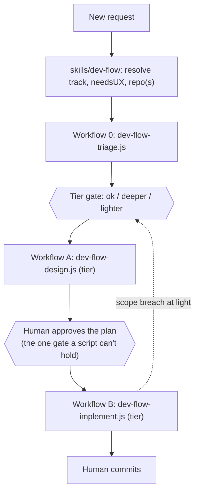
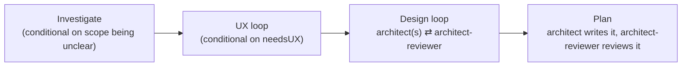
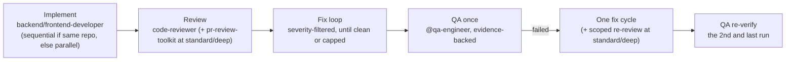

`/dev-flow` automates the design-gate and review-gate rounds of the [engineering
loop](../concepts/#deterministic-orchestration-dev-flow) as real control flow —
not the model remembering to keep looping correctly on its own. This page is the
mechanics: why it's built as a skill *plus* three `Workflow` scripts rather than
either alone, what each phase actually does, and how the loops know when to stop.

## Why a hybrid, not one or the other

A skill alone can't guarantee it keeps looping correctly — that depends on the
model remembering to. The `Workflow` tool alone can't pause mid-run to ask you
anything — a script runs start to finish autonomously, and this repo's own hard
rule is that non-trivial work needs your explicit plan approval before
implementation starts. So the design splits along that exact seam:

- **`skills/dev-flow/SKILL.md`** (thin) — resolves the request, holds the one
  human approval gate, and is the only place that talks to you.
- **`workflows/dev-flow-triage.js`**, **`workflows/dev-flow-design.js`** and **`workflows/dev-flow-implement.js`** —
  real JavaScript, run by the `Workflow` tool, no human interaction inside them.

## Tiers — proportional effort

Before any design work, `workflows/dev-flow-triage.js` runs one read-only agent
(`@task-triager`, `Read`/`Glob`/`Grep`, `haiku`) that answers a fixed questionnaire
with facts only: which files the change would touch, whether they are new, whether it
touches a public contract, security surface, or stored data, whether it adds a
dependency, how reversible it is, what build/test commands exist. It never returns a
verdict. A deterministic function in the script scores size (file count, module
spread, new module, new files, both tracks) and risk (contract, security, persistence,
dependencies, reversibility, unknowns, precedent) and takes the higher of the two;
raise-only safety floors then lift it to at least `standard` for security,
persistence, a public contract, a non-revertible change, low confidence or more than two
unknowns, a UX pass, no located files, or a logic change in a repo with no build or test
command. You see the tier, both scores, the floors that held and the worst-case call
row at the **tier gate** and answer `ok`, `deeper` or `lighter` (or pass `--tier`).
If triage fails, the run is `standard`.

| | `light` | `standard` | `deep` |
|---|---|---|---|
| Investigate | never | only if triage confidence is low | always |
| UX loop | never (UX pass skipped) | if `needsUX`, up to 3 rounds | if `needsUX`, up to 3 rounds |
| Design | one pass writes a change brief to `plan.md`, one review, no loop | loop, up to 3 rounds | loop, up to 3 rounds |
| Separate Plan phase | folded into the brief | yes, plus a review | yes, plus a review |
| Review floor (what blocks) | `blocking` only | `blocking` + `major` | everything |
| Reviewers per pass | `code-reviewer` only | `code-reviewer` + `pr-review-toolkit` | same |
| Architect / reviewer effort | medium / low | high / medium | high / high |
| Post-QA fix re-review | none (disclosed in the report) | one scoped `code-reviewer` call | same |
| Scope-breach escalation | halts and re-gates at `standard` | logged only | logged only |

Worst-case agent calls (computed from the caps, then reproduced exactly by the mock
suite with adversarial stubs: reviewers never clean, design never approved, QA always
failing):

| Tier | Design A (`both`, +UX) | Implement B (`both`) | Whole run incl. triage | One track, +UX |
|---|---|---|---|---|
| `light` | 4 (no UX) | 13 | 18 | 12 (no UX) |
| `standard` | 23 | 22 | 46 | 38 |
| `deep` | 27 | 22 | 50 | 42 |

The worst-case figures are hard caps, and the mock suite (`tests/workflows/`) asserts that
adversarial runs (reviewers never clean, design never approved, QA always failing) hit each
cell exactly and never trip the call-ceiling backstop; a typical run makes far fewer calls.
`standard` and `deep` share caps because deep differs in floors, effort and investigation, not
call count (a later phase adds deep-tier design fan-out and raises its caps).

Two consequences to know. `light` hides `major` and `minor` findings by design — its
single design review does not loop, so any `blocking` finding is surfaced at the plan
gate ("design did not converge — N blocking findings") and you can reply `deeper`. And a
tier is a prediction: if the first review at `light` finds the change on a risk surface
the plan did not list (or in the next file-count band), Workflow B halts with
`haltedBy: escalation` before QA, and the skill asks whether to keep, stash or discard
the working tree and re-runs the gate preset to `standard` (one re-entry at most).

## Workflow A — investigate, design, plan

- **Investigate** — per tier: always at `deep`, at `standard` only if triage
  confidence was low, never at `light`; `@product-owner` frames the problem first.
- **UX** — only runs if the work needs a fresh UX pass (new flow, new screen) and
  the tier is `standard` or `deep` — `@ux-designer` ⇄ `@figma-designer` ⇄
  fidelity-check, looping until approved.
- **Design** — one architect per track (`@backend-architect` and/or
  `@frontend-architect`, run in parallel when the work spans both) ⇄
  `@architect-reviewer`, looping until approved. Each round's feedback is fed
  into the next round's prompt — a retry is a refinement, not a blind re-roll.
  Each architect call writes its solution doc itself (no separate writer call).
  Reviewers tag every finding `blocking`, `major` or `minor`; the script, not the
  reviewer, decides the verdict by applying the tier's floor. At `light` this is a
  straight line: one architect call writes a short change brief to `plan.md`
  (two briefs and one writer call for `both`), one review, no solution doc.
- **Plan** — (`standard`/`deep`) the architect writes the implementation plan from
  the designs that actually came back (`tracksCompleted`); `@architect-reviewer`
  reviews it once more. `Workflow A` returns the plan plus whether the design
  loop actually converged — if it capped out instead, the skill says so plainly
  when it shows you the plan, rather than presenting a capped-out draft the same
  way it'd present an approved one.

## The human gate

`Workflow A` runs to completion and returns; the skill shows you the plan and
waits for an ordinary conversational approval — this is not a pause *inside* a
`Workflow` run, since there's no such thing. `Workflow B` is a separate call,
made only after you approve. The state that survives between them is just the
plan file already written to `docs/work/<slug>/plans/plan.md` — approving days
later, even in a new session, is "read that file, call `Workflow B`." No special
resume mechanism, no extra persistence layer.

After you approve, the skill appends a `> dev-flow: approved by user on <date>`
marker to `plan.md`, invokes `/addit-harness:adr` once for every line under the
plan's `## ADR candidates` heading (the architect lists the decisions that are
significant and hard to reverse; `none` is a valid answer), and hashes the final
file. `Workflow B` is only allowed to start when a `PreToolUse` hook
(`hooks/gate-dev-flow-implement.sh`) confirms `plan.md` exists, carries that
marker, and still hashes to the `planSha256` passed to the workflow; the script
re-checks the hash format as a second layer. Every other `Workflow` call passes
through untouched.

**What the gate does and doesn't do.** It stops accidents: calling
`/addit-harness:dev-flow-implement` directly, a stale slug, a plan edited after
approval. It does **not** stop a model that ignores its instructions and writes
the marker and hash itself — your approval in the conversation remains the real
gate.

## Workflow B — implement, review, verify once

- **Implement** — `@backend-developer` and/or `@frontend-developer` build the
  approved plan. Two tracks in the *same* repo run sequentially, never in
  parallel, to avoid concurrent writes to one branch; genuinely separate repos
  run in parallel since there's no shared-branch conflict.
- **Review** — `@code-reviewer` (always present) plus, at `standard`/`deep` and
  when installed, the `pr-review-toolkit` bundle (`pr-test-analyzer`,
  `silent-failure-hunter`, `type-design-analyzer`, `comment-analyzer`). A missing
  optional plugin degrades gracefully; a genuine failure of the required
  reviewer is logged, never silently treated as "clean." Findings are
  severity-tagged and only those at or above the tier's floor count; the
  reviewers also report `touchedFiles` for the scope-breach check.
- **Fix loop** — findings route to the track they're tagged for; developers fix,
  reviewers re-check. Up to two fix rounds, then a final **verdict-only pass**
  (`@code-reviewer` alone) so the reported verdict is about the code as it
  stands after the last fix, not the code before it.
- **QA** — `@qa-engineer` verifies once and writes an evidence-backed report (a
  real exit code, screenshot, or log — never a bare "looks good"). It runs even
  if the fix loop never reached clean, so the report reflects real final state
  rather than an assumption. On the happy path that is the only QA call.
- **QA fix** — only if QA failed. A QA failure is blocking at every tier (no
  severity floor): developers get one fix cycle, `standard`/`deep` add one
  scoped `@code-reviewer` call over that fix (`light` does not, and the report
  says so), then QA re-verifies. That is the second and last QA run; a second
  failure is returned as `qaPassed: false`, never looped on.

You still run `git commit` yourself — `dev-flow` never commits.

## When one agent fails

Every agent call goes through one wrapper. A single failed call is logged and
the run continues; a budget-exceeded or schema-contradiction error halts the
run and is reported as `haltedBy` (`budget-cap` or `config-error`). Each
workflow also carries a per-tier call-ceiling backstop (`call-ceiling`) that must
never fire under correct code; the mock suite asserts it doesn't. A loop that
stops because its findings repeat is *not* a halt — it is reported as
`designBreaker` / `reviewBreaker`, and QA still runs afterwards.

## How the loops know when to stop

Every loop needs more than "keep trying until approved," because a bare retry
count can't tell genuine slow progress from a stuck loop. Each one combines four
signals:

| Signal | What it catches |
|---|---|
| **Convergence** | The actual success condition — approved, or zero findings |
| **Hard round cap** | A backstop so nothing runs forever |
| **Token-budget guard** | Stops early if the run is burning an unusual amount |
| **Non-progress circuit breaker** | Aborts immediately if a round's findings exactly match the previous round's — a stuck loop, not a converging one |

The two caps are deliberately different, not copy-pasted: the design-gate loop
caps at **3 rounds**, the review-gate fix loop at **2** (plus the final verdict-only pass). At a cap of 2, the
circuit breaker can only ever compare on the very last allowed round, which
makes it unable to save any work — 3 is the minimum depth where "stop early"
and "hit the cap anyway" are actually different outcomes. The review loop's
breaker earns its keep at 2, so it stays there.

## Track, UX, and repo resolution

- **`track`** is exactly `backend`, `frontend`, or `both` — inferred from the
  request, asked via a clarifying question only when genuinely ambiguous.
- **`needsUX`** is a separate flag from track — true only for work that needs a
  fresh UX pass, not implied by "this touches the frontend."
- **`repo`** defaults to the directory you're already in, same as `/code-review`
  or `/save-plan` — no need to specify it for the common case. A second repo is
  only asked for when `track: both` spans two genuinely separate codebases and a
  quick check of the working directory can't already tell.

## If the `Workflow` tool isn't available

The skill checks whether `Workflow` is actually callable before using it, rather
than assuming from configuration. If it isn't, `skills/dev-flow/SKILL.md`
documents a full manual fallback: the identical phase order and loop logic,
driven by direct sequential `@agent` calls instead of a script. Slower, same
gates, same outcome.

## Source

`skills/dev-flow/SKILL.md`, `workflows/dev-flow-triage.js`,
`workflows/dev-flow-design.js`, `workflows/dev-flow-implement.js` — plugin root, not nested under the skill.

## Next

- [Subagents](../subagents/) — what `@qa-engineer` and the architects/developers
  `dev-flow` drives actually do.
- [Use cases](../use-cases/) — where this fits in the full build walkthrough.
