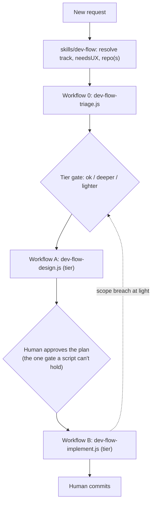
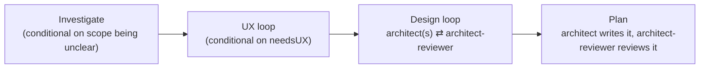
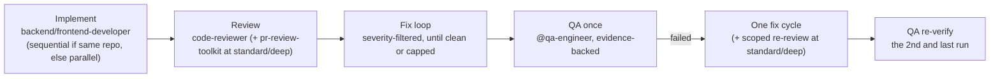
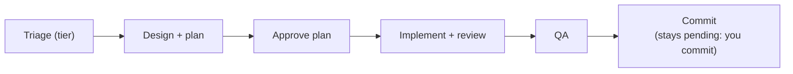

`/dev-flow` automates the design-gate and review-gate rounds of the [engineering
loop](../concepts/#deterministic-orchestration--dev-flow) as real control flow —
not the model remembering to keep looping correctly on its own. This page is the
mechanics: why it's built as a skill *plus* three `Workflow` scripts rather than
either alone, what each phase actually does, and how the loops know when to stop.

## Why a hybrid, not one or the other

A skill alone can't guarantee it keeps looping correctly — that depends on the
model remembering to. The `Workflow` tool alone can't pause mid-run to ask you
anything — a script runs start to finish autonomously, and this repo's own hard
rule is that non-trivial work needs your explicit plan approval before
implementation starts. So the design splits along that exact seam:

- **`skills/dev-flow/SKILL.md`** (thin) — resolves the request, holds the one
  human approval gate, and is the only place that talks to you.
- **`workflows/dev-flow-triage.js`**, **`workflows/dev-flow-design.js`** and **`workflows/dev-flow-implement.js`** —
  real JavaScript, run by the `Workflow` tool, no human interaction inside them.



## Tiers — proportional effort

Before any design work, `workflows/dev-flow-triage.js` runs one read-only agent
(`@task-triager`, `Read`/`Glob`/`Grep`, `sonnet`) that answers a fixed questionnaire
with facts only: which files the change would touch, whether they are new, whether it
touches a public contract, security surface, or stored data, whether it adds a
dependency, how reversible it is, what build/test commands exist. It never returns a
verdict. A deterministic function in the script scores size (file count, module
spread, new module, new files, both tracks) and risk (contract, security, persistence,
dependencies, reversibility, unknowns, precedent) and takes the higher of the two;
raise-only safety floors then lift it to at least `standard` for security,
persistence, a public contract, a non-revertible change, low confidence or more than two
unknowns, a UX pass, no located files, or a logic change in a repo with no build or test
command. You see the tier, both scores, the floors that held and the worst-case call
row at the **tier gate** and answer `ok`, `deeper` or `lighter` (or pass `--tier`).
If triage fails, the run is `standard`.

| | `light` | `standard` | `deep` |
|---|---|---|---|
| Investigate | never | only if triage confidence is low | always |
| UX loop | never (UX pass skipped) | if `needsUX`, up to 3 rounds | if `needsUX`, up to 3 rounds |
| Design | one pass writes a change brief to `plan.md`, one review, no loop | loop, up to 3 rounds | loop, up to 3 rounds |
| Separate Plan phase | folded into the brief | yes, plus a review | yes, plus a review |
| Review floor (what blocks) | `blocking` only | `blocking` + `major` | everything |
| Reviewers per pass | `code-reviewer` only | `code-reviewer` + `pr-review-toolkit` | same |
| Architect / reviewer effort | medium / low | high / medium | high / high |
| Post-QA fix re-review | none (disclosed in the report) | one scoped `code-reviewer` call | same |
| Scope-breach escalation | halts and re-gates at `standard` | logged only | logged only |

Worst-case agent calls per tier. These are hard caps in the scripts
(`POLICY.callCap` in each workflow); the mock suite reproduces each cell exactly with
adversarial stubs (reviewers never clean, design never approved, QA always failing).
They are mock-asserted, not measured on live runs, and they do not count the
`@product-owner` intake calls the skill makes before Workflow A. The
`standard`/`deep` design caps include the call that scores your proposed approach
(one per track) and, at `deep`, the three explorers and one candidate switch:

| Tier | Design A (`both`, +UX) | Implement B (`both`) | Whole run incl. triage | One track, +UX |
|---|---|---|---|---|
| `light` | 4 (no UX) | 13 | 18 | 12 (no UX) |
| `standard` | 23 | 22 | 46 | 38 |
| `deep` | 27 | 22 | 50 | 42 |

A typical run makes far fewer calls. Implement caps are the same at `standard` and
`deep`; the extra `deep` design calls are the parallel explorers described below.

Two consequences to know. `light` hides `major` and `minor` findings by design — its
single design review does not loop, so any `blocking` finding is surfaced at the plan
gate ("design did not converge — N blocking findings") and you can reply `deeper`. And a
tier is a prediction: if the first review at `light` finds the change on a risk surface
the plan did not list (or in the next file-count band), Workflow B halts with
`haltedBy: escalation` before QA, and the skill asks whether to keep, stash or discard
the working tree and re-runs the gate preset to `standard` (one re-entry at most).

## Intake — interview and brief

Between the tier gate and Workflow A, the skill turns the request into a one-page
brief, scaled by tier:

- **`light`:** no interview and no brief; the request is used as written.
- **`standard`:** `@product-owner` (in `mode=questions`) reads the request and the code
  and returns only the questions whose answer changes the approach or the done
  criteria, at most three, each with a recommended default. You get one batch of at
  most four questions; the first slot is the tier gate itself. Zero questions is a
  valid outcome. `@product-owner` then writes `docs/work/<slug>/specs/brief.md`
  (`mode=brief`, at most 50 lines): your request quoted verbatim, goal, non-goals,
  constraints, limits, done criteria, assumptions and unknowns. Problem only, never
  a solution.
- **`deep`:** the same, plus at most one more batch of four for gaps your answers
  opened. If any default was applied, you confirm the brief before design starts.

If your request already proposes a solution ("add a Redis cache"), the brief moves
that text verbatim to `specs/owner-proposal.md` and leaves `[proposed approach moved
out]` in its place. The architects do not see it while they generate candidates; it
reaches the design only as candidate "Owner", scored like the others at the
comparison step. In a headless run every default is applied, and the skill says so.

## Workflow A — investigate, design, plan



- **Investigate** — per tier: always at `deep`, at `standard` only if triage
  confidence was low, never at `light`; `@product-owner` frames the problem. A brief
  from intake already covers this, so the workflow skips its own investigator.
- **UX** — only runs if the work needs a fresh UX pass (new flow, new screen) and
  the tier is `standard` or `deep` — `@ux-designer` ⇄ `@figma-designer` ⇄
  fidelity-check, looping until approved.
- **Design** — one architect per track (`@backend-architect` and/or
  `@frontend-architect`, run in parallel when the work spans both) ⇄
  `@architect-reviewer`, looping until approved. Each round's feedback is fed
  into the next round's prompt — a retry is a refinement, not a blind re-roll.
  Each architect call writes its solution doc itself (no separate writer call).
  Each architect follows the [solution method](../engineering-loop/#the-solution-method):
  at least three structurally different candidates (one unconventional), prior art,
  a pre-mortem, and your proposed approach scored only at the comparison step. At
  `deep`, three explorer calls run in parallel on the track that holds more of the
  risky files, one per candidate lens (proven, minimal, unconventional); a
  synthesizer then compares them with your idea and writes the solution.
  `@architect-reviewer` reviews as a red team and may return a `betterAlternative`;
  at `deep` that triggers one candidate switch (a re-synthesis around the reviewer's
  pick) outside the round count. Reviewers tag every finding `blocking`, `major` or
  `minor`; the script, not the reviewer, decides the verdict by applying the tier's
  floor. At `light` this is a
  straight line: one architect call writes a short change brief to `plan.md`
  (two briefs and one writer call for `both`), one review, no solution doc.
- **Plan** — (`standard`/`deep`) the architect writes the implementation plan from
  the designs that actually came back (`tracksCompleted`); `@architect-reviewer`
  reviews it once more. `Workflow A` returns the plan plus whether the design
  loop actually converged — if it capped out instead, the skill says so plainly
  when it shows you the plan, rather than presenting a capped-out draft the same
  way it'd present an approved one.

## The human gate

`Workflow A` runs to completion and returns; the skill shows you the plan and
waits for an ordinary conversational approval — this is not a pause *inside* a
`Workflow` run, since there's no such thing. `Workflow B` is a separate call,
made only after you approve. The state that survives between them is just the
plan file already written to `docs/work/<slug>/plans/plan.md` — approving days
later, even in a new session, is "read that file, call `Workflow B`." No special
resume mechanism, no extra persistence layer.

After you approve, the skill appends a `> dev-flow: approved by user on <date>`
marker to `plan.md`, invokes `/addit-harness:adr` once for every
`ADR: candidate "<title>"` line in the solution docs' `## Decision` (at `light`, in
the plan's `## Approach`; `none` is skipped) so the ADR link replaces that line, and
then hashes the final file (`planSha256`). `Workflow B` is only allowed to start when a `PreToolUse` hook
(`hooks/gate-dev-flow-implement.sh`) confirms `plan.md` exists, carries that
marker, and still hashes to the `planSha256` passed to the workflow; the script
re-checks the hash format as a second layer. Every other `Workflow` call passes
through untouched.

**What the gate does and doesn't do.** It stops accidents: calling
`/addit-harness:dev-flow-implement` directly, a stale slug, a plan edited after
approval. It does **not** stop a model that ignores its instructions and writes
the marker and hash itself — your approval in the conversation remains the real
gate.

## Workflow B — implement, review, verify once



- **Implement** — `@backend-developer` and/or `@frontend-developer` build the
  approved plan. Two tracks in the *same* repo run sequentially, never in
  parallel, to avoid concurrent writes to one branch; genuinely separate repos
  run in parallel since there's no shared-branch conflict.
- **Review** — `@code-reviewer` (always present) plus, at `standard`/`deep` and
  when installed, the `pr-review-toolkit` bundle (`pr-test-analyzer`,
  `silent-failure-hunter`, `type-design-analyzer`, `comment-analyzer`). A missing
  optional plugin degrades gracefully; a genuine failure of the required
  reviewer is logged, never silently treated as "clean." Findings are
  severity-tagged and only those at or above the tier's floor count; the
  reviewers also report `touchedFiles` for the scope-breach check.
- **Fix loop** — findings route to the track they're tagged for; developers fix,
  reviewers re-check. Up to two fix rounds, then a final **verdict-only pass**
  (`@code-reviewer` alone) so the reported verdict is about the code as it
  stands after the last fix, not the code before it.
- **QA** — `@qa-engineer` verifies once and writes an evidence-backed report (a
  real exit code, screenshot, or log — never a bare "looks good"). It runs even
  if the fix loop never reached clean, so the report reflects real final state
  rather than an assumption. On the happy path that is the only QA call.
- **QA fix** — only if QA failed. A QA failure is blocking at every tier (no
  severity floor): developers get one fix cycle, `standard`/`deep` add one
  scoped `@code-reviewer` call over that fix (`light` does not, and the report
  says so), then QA re-verifies. That is the second and last QA run; a second
  failure is returned as `qaPassed: false`, never looped on.

You still run `git commit` yourself — `dev-flow` never commits.

## Watching a run

Two built-in Claude Code surfaces show where a run is. Neither needs a status
line or any extra setting beyond what setup places.

**Progress lines in `/workflows`.** While a workflow runs, Claude Code's
`/workflows` view shows the phase and the script's `log()` lines. The workflows
write fixed-format lines for the run's state:

| Line | When |
|---|---|
| `dev-flow <triage\|design\|implement> start: tier=<tier> track=<track>` | Once, at the start of each workflow. Triage logs `tier=pending` unless it was given a tier |
| `Triage: tier=<tier> S=<n> R=<n> floors=<list\|none>` | After triage scores the request |
| `<UX\|Design\|Plan\|Review\|QA fix> r<n>/<cap>: <k> at/above <floor>` | After each review round; `<k>` counts the findings at or above the tier's floor (`blocking`, `major` or `minor`), and the line names that floor |
| `gate <design_review\|code_review\|qa>: <verdict>` | When a gate is decided; the verdict is `pass`, `fail`, `blocked` (the run halted) or `skipped`. A QA failure that gets its fix cycle first logs `gate qa first: fail`; the plain `gate qa` line is always the final verdict |
| `HALT <haltedBy>: <reason>` | When the run halts (`budget-cap`, `config-error`, `call-ceiling`, `implement-failed`, `escalation`); the reason is fixed text or counts |

These lines carry no request text, brief, agent output or file paths: only tier,
track, round numbers, counts, gate names, verdicts and fixed reason text. An
agent's error message is never logged, and a scope-breach escalation logs only
how many files fall outside the plan (the paths are in the run's result, which
the skill shows you). The skill points you at `/workflows` instead of narrating
progress in the conversation.

**The lifecycle task list.** Setup's `settings.json` template sets
`CLAUDE_CODE_ENABLE_TODO_TOOLS=1`, because the task tools are off by default on
newer models (a probe on `claude-sonnet-5-5` saw no `TaskCreate` without it and
the full set with it). With the tools on, `/dev-flow` creates six tasks right
after triage and moves them as the run passes each step:



- `Triage` is done once you answer the tier gate; its subject gains the tier.
- `Design + plan` is in progress while `Workflow A` runs, `Approve plan` while
  the plan waits for you, `Implement + review` while `Workflow B` runs. `QA` is
  marked done only if QA ran.
- A halted run (or a plan you do not approve) leaves the current task in
  progress with ` (halted: <haltedBy>)` added to its subject.
- Task text is the six names plus the tier and the halt id: no request text,
  code or paths.

Without the task tools (setup not run, or `CLAUDE_CODE_ENABLE_TODO_TOOLS` unset
or set to anything other than `1`, which setup never overwrites), the skill skips
the list silently. The variable lives in your `settings.json` `env`, and setup
merges `env` key by key with your values winning, so a value you set yourself is
never overwritten (see [Getting started](../getting-started/#what-setup-does-to-your-settingsjson)).

**Not yet proven in a live terminal:** whether the model always issues every
task update at the right step (the list can go stale if it skips one), how much
context the task tools add to each turn, and whether the one-line task-panel
summary of a running workflow shows the latest `log()` line or only the phase.
The progress lines themselves are checked by the mock suite (see
[Testing the workflows](#testing-the-workflows)); the task list is not.

## When one agent fails

Every agent call goes through one wrapper. A single failed call is logged and
the run continues; a budget-exceeded or schema-contradiction error halts the
run and is reported as `haltedBy` (`budget-cap` or `config-error`). A developer agent that
returns nothing halts the implement workflow as `implement-failed` before review, so an
empty diff is never reported as clean. Each
workflow also carries a per-tier call-ceiling backstop (`call-ceiling`) that must
never fire under correct code; the mock suite asserts it doesn't. A loop that
stops because its findings repeat is *not* a halt — it is reported as
`designBreaker` / `reviewBreaker`, and QA still runs afterwards.

## How the loops know when to stop

Every loop needs more than "keep trying until approved," because a bare retry
count can't tell genuine slow progress from a stuck loop. Each one combines four
signals:

| Signal | What it catches |
|---|---|
| **Convergence** | The actual success condition — approved, or zero findings |
| **Hard round cap** | A backstop so nothing runs forever |
| **Token-budget guard** | Stops early if the run is burning an unusual amount |
| **Non-progress circuit breaker** | Aborts immediately if a round's findings exactly match the previous round's — a stuck loop, not a converging one |

The two caps are deliberately different, not copy-pasted: the design-gate loop
caps at **3 rounds**, the review-gate fix loop at **2** (plus the final verdict-only pass). At a cap of 2, the
circuit breaker can only ever compare on the very last allowed round, which
makes it unable to save any work — 3 is the minimum depth where "stop early"
and "hit the cap anyway" are actually different outcomes. The review loop's
breaker earns its keep at 2, so it stays there.

## Track, UX, and repo resolution

- **`track`** is exactly `backend`, `frontend`, or `both` — inferred from the
  request, asked via a clarifying question only when genuinely ambiguous.
- **`needsUX`** is a separate flag from track — true only for work that needs a
  fresh UX pass, not implied by "this touches the frontend."
- **`repo`** defaults to the directory you're already in, same as `/code-review`
  or `/save-plan` — no need to specify it for the common case. A second repo is
  only asked for when `track: both` spans two genuinely separate codebases and a
  quick check of the working directory can't already tell.

## If the `Workflow` tool isn't available

The skill checks whether `Workflow` is actually callable before using it, rather
than assuming from configuration. If it isn't, `skills/dev-flow/SKILL.md`
documents a full manual fallback: the identical phase order and loop logic,
driven by direct sequential `@agent` calls instead of a script. Slower, same
gates, same outcome.

## Testing the workflows

`tests/workflows/mock-run.mjs` runs a real workflow script with only the runtime
calls (`agent`, `parallel`, `phase`, `log`, `budget`) stubbed, and fails if a script
uses `Date.now()`, `new Date()` or `Math.random()`. Each file in
`tests/workflows/scenarios/` scripts the agents' answers and asserts the result:

```bash
node tests/workflows/mock-run.mjs workflows/dev-flow-implement.js implement-bounds
node tests/workflows/mock-run.mjs workflows/dev-flow-design.js design-fanout-bounds
node tests/workflows/mock-run.mjs workflows/dev-flow-triage.js triage-table
```

Scenarios cover the worst-case caps, the severity floors, QA running once, the scope
breach escalation, an empty developer result, reviewers that throw, a missing
optional plugin, the `deep` fan-out (including a degraded one) and in-place
revisions. Every scenario run is also checked against the progress-line
contract (`tests/workflows/log-contract.mjs`): exactly one start line naming the
right workflow, gate names and verdicts from the telemetry contract's enums, round
numbers within their cap, a `HALT` line for every `haltedBy`, and no line that
contains the request, the owner proposal or the brief path. The mocks prove
control flow, call counts and log format, not the quality of what the agents
write.

## Source

`skills/dev-flow/SKILL.md`, `workflows/dev-flow-triage.js`,
`workflows/dev-flow-design.js`, `workflows/dev-flow-implement.js` — plugin root, not nested under the skill.

## Next

- [Subagents](../subagents/) — what `@qa-engineer` and the architects/developers
  `dev-flow` drives actually do.
- [Use cases](../use-cases/) — where this fits in the full build walkthrough.
