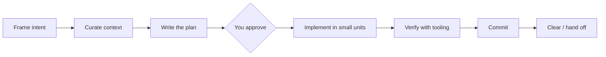
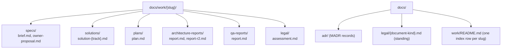

`rules/engineering-loop.md` loads into every session. It is the process every
agent and skill in addit-harness follows, whether you drive the agents by hand
or let [`/dev-flow`](../dev-flow/) drive them. `references/doc-protocol.md` sets
how the documents the loop produces are written.

**On this page**
- [The loop](#the-loop)
- [Where documents go](#where-documents-go)
- [Slugs and collisions](#slugs-and-collisions)
- [The doc protocol](#the-doc-protocol)
- [The solution method](#the-solution-method)

## The loop

1. **Frame intent:** restate the goal, constraints and what "done" means; ask
   first if an ambiguity changes the approach.
2. **Curate context:** read the code that matters; reuse what exists.
3. **Write the plan:** for non-trivial work, to the doc protocol below. After
   approval, `/save-plan` persists it to `docs/work/<slug>/plans/` and a tracked
   task list is created from its steps.
4. **Implement** one concern at a time.
5. **Verify** with tests, build or lint. "Done" means it ran, not that the code
   looks right.
6. **Commit** at a coherent checkpoint. Agents never commit on their own; you do.
7. **Clear / hand off:** summarize decisions before context runs out.

## Where documents go

Everything produced for one unit of work (feature, fix, improvement) lives in
one folder, `docs/work/<slug>/`, split by document type:

| Subfolder | Holds | Written by |
|---|---|---|
| `specs/` | Intake brief `brief.md`; a proposed solution moved out of the request into `owner-proposal.md` | `@product-owner` |
| `solutions/` | Architecture and design docs, no to-do list | `@backend-architect`, `@frontend-architect`, `@ux-designer` |
| `plans/` | Implementation plan with steps and acceptance criteria | Main session via `/save-plan`, or the architect inside `/dev-flow` |
| `architecture-reports/` | Design review reports | `@architect-reviewer` |
| `qa-reports/` | Evidence-backed QA reports | `@qa-engineer` |
| `legal/` | Per-change legal analysis | `@saas-legal-advisor` |

Repeat review rounds get a suffix (`report-r2.md`) instead of overwriting the
earlier report. ADRs go to `docs/adr/` and standing legal documents to
`docs/legal/<document-kind>.md`.

**Plugin conventions win.** These locations apply even when your repo already
has its own plans, ADR or legal folders. Agents read those folders as input but
write to the locations above. A project `CLAUDE.md` adds facts; it does not move
these folders.

## Slugs and collisions

- The slug is `<YYYY-MM-DD>-<short-name>`, or `<ticket-id>-<short-name>` when the
  work has an issue-tracker ticket.
- A slug is the same work item only if the current session created it or was
  given it. Otherwise, if `docs/work/<slug>/` already exists, the new work item
  gets `-2`, `-3` and so on. Work-item artifacts are never overwritten.
- Standing documents are edited in place, and git keeps their history:
  `docs/legal/`, `docs/adr/README.md`, `docs/work/README.md` and
  `.claude/design-conventions.md`.

## The doc protocol

`references/doc-protocol.md` applies to every agent or skill that writes a plan,
solution, review report, ADR, Figma spec or index row.

- **Templates.** Each document type has a template (plan, solution, intake
  brief, review report, ADR, Figma implementation spec, index row). Empty
  sections are left out, never filled with "N/A".
- **Current state only.** A document describes the design as it is now. History
  lives in git and in a `## Log` of at most 5 lines.
- **Edit in place.** A revision rewrites only the sections the findings name and
  deletes superseded text. Review rounds after the first report deltas only:
  which earlier findings are resolved, plus new findings.
- **Evidence labels.** Claims about existing code, runtime behaviour,
  third-party systems or design data are labelled **Observed** (with evidence: a
  `path:line`, a command and its output, a Figma node id), **Inferred** (with the
  premise) or **Unknown** (listed with what would resolve it). Runtime behaviour
  counts as Observed only after a probe ran. A claim with no evidence is removed.
- **Diagrams stay.** Plans, solutions and structural ADRs include mermaid
  diagrams, one per concept (structure, flow, interaction, state), showing the
  current design. Only trivial edits skip them.
- **Length ceilings** (lines, at most):

| Document | `light` | `standard` | `deep` |
|---|---|---|---|
| Plan | 40 (the change brief) | 120 | 200 |
| Solution | none written | 200 | 350 |

Review reports: at most 120 lines for round 1, 80 for a later delta. Intake
brief: at most 50. ADRs: at most 60 (minimal) or 80 (full). Going over a ceiling
needs a one-line reason in the `## Log`.

These rules are instructions to the agents; nothing blocks a file that breaks
them. If you turn on [local telemetry](../telemetry/), the export reports how
many plans and solutions stayed within the `deep` ceiling and how many revisions were
made as in-place edits.

## The solution method

Every architect agent (`@backend-architect`, `@frontend-architect`,
`@cloud-architect`) follows `references/solution-method.md` for non-trivial
design, and `@ux-designer` applies it to flow concepts:

1. **Frame** the goal, constraints, non-goals and the numbers that matter.
2. **Reframe:** name the problem class, the first principles, and the cheapest
   way to not need the change at all.
3. **Diverge:** at least three candidates that differ in structure, not vendor:
   a proven one, a minimal one, and an unconventional one (typicality ≤ 0.3).
4. **Prior art:** at least two cited sources, or "none found" plus the queries
   tried. Citations are never invented.
5. **Quantify** each candidate, with the arithmetic shown.
6. **Pre-mortem** the top two: three specific failure stories each.
7. **Compare** in a weighted matrix. A solution you proposed in the request is
   added only here, as candidate "Owner", and scored like the others
   (anti-anchoring: the architect does not see it before step 7).
8. **Recommend:** the choice, the runner-up, kill criteria, and an
   `ADR: candidate "<title>"` line (or `none`).

`@architect-reviewer` reviews as a red team: it checks whether the candidates
really diverge, redoes the riskiest calculation, spot-checks one citation, and
can name a `betterAlternative` instead of burying it as a finding. Inside
`/dev-flow`, the method scales by tier: `light` shrinks steps 3 to 6 to a line
each, `standard` runs steps 7 and 8 in a separate call that brings in your idea,
and `deep` runs three parallel explorers (one per candidate lens) plus a
synthesizer. ADRs are written only after you approve the plan, from the
`ADR: candidate` lines.

## Next

- [How dev-flow works](../dev-flow/): the same loop, automated.
- [Subagents](../subagents/): who writes which document.
