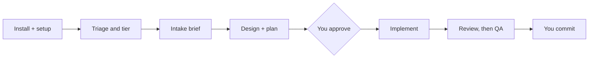

One small, realistic change, followed from install to commit. The request: **add
pagination to an existing `GET /orders` endpoint in a Go service.** Output blocks
below are **illustrative output** — the shape is real, the wording and numbers
are not from a recorded run. The mechanics behind each step are in
[How dev-flow works](../dev-flow/).



## 1. Install and set up

In Claude Code, from any project:

```
/plugin marketplace add addit-digital/addit-harness
/plugin install addit-harness@addit
/addit-harness:setup
```

`setup` places the files a plugin can't carry on its own (`CLAUDE.md`,
`AGENTS.md`, `rules/`, `settings.json`). Details:
[Getting started](../getting-started/).

## 2. Start the flow

From the root of the service repo:

```
/addit-harness:dev-flow add cursor pagination to GET /orders
```

The skill infers `track` (an API change, so `backend`) and whether a UX pass is
needed (no). It only asks when the request and the repo don't settle it.

## 3. Triage and the tier

A read-only agent reports facts about the change (files likely touched, whether it
changes a public contract, touches data, adds a dependency). A deterministic script —
not the agent — scores them into a tier: `light`, `standard` or `deep`. A change to
a public API response is the kind of fact that pushes the tier up. You see something like:

```
Tier: standard   (size: medium, risk: medium)
Public contract touched: yes   Dependency added: no
Reply: ok / deeper / lighter
```

At `standard` and `deep` this question is the first slot of the first intake batch,
not a separate prompt. To skip triage, pass `--tier light|standard|deep`.

## 4. Intake: questions, defaults, brief

At `standard`, the product-owner agent asks up to four questions in one batch. For
this request they might be:

```
1. Tier: ok / deeper / lighter
2. Cursor or offset pagination?  (default: cursor)
3. Default and maximum page size?  (default: 50 / 200)
4. Must existing clients that send no parameters keep working?  (default: yes)
```

Accept the defaults or answer. The result is a one-page brief at
`docs/work/<slug>/specs/brief.md`. It quotes your original request, states the
problem, and lists which defaults were applied, so you can see what was assumed.
At `light` there is no interview and no brief.

## 5. Design and plan

Architect agents write a solution doc, and an architect-reviewer checks it, for up
to three rounds. The architect generates its own alternatives before it sees your
idea, so a proposal of yours gets compared rather than rubber-stamped. Then it writes
the plan. When the run returns you see the plan and whether the design converged:

```
Design approved after 2 rounds. Plan: docs/work/2026-10-01-orders-pagination/plans/plan.md
Waiting for your approval before anything is implemented.
```

If the design did **not** converge, you are told first, plainly: it is a capped-out
draft, not an approved design.

## 6. The approval gate

Read the plan. Nothing is implemented until you say so in your own message
("approved", "go ahead"). The skill then records the approval in `plan.md` and
fingerprints the file; a hook refuses to start the implementation step if the plan
was edited afterwards. Silence is not approval.

## 7. Implement, review, QA

The developer agent builds the approved plan. Review then runs, with a fix loop
capped at two rounds, and `@qa-engineer` verifies once (and again only if a fix was
needed). Findings come with evidence such as a command and its exit code:

```
Review: clean after 1 fix round.   QA: passed (1 run).
`go test ./...` exit 0; GET /orders?limit=2 returned a next_cursor.
I have not committed anything. That is your call.
```

At `light`, review hides major and minor findings by design; at `standard` it hides
minor ones. The report says so.

## 8. Where the documents land

```
docs/work/2026-10-01-orders-pagination/
  specs/brief.md                  intake brief
  solutions/solution-backend.md   the design
  architecture-reports/report.md  the design review
  plans/plan.md                   the approved plan
  qa-reports/report.md            the QA evidence
docs/work/README.md               one index row, owned by the skill
```

Plugin conventions win over a project's own doc layout. Documents are short, describe
the current state, keep their diagrams and are edited in place.

## 9. Commit

`dev-flow` never commits. Look at the diff, then commit as usual:

```
git status
git add -A && git commit -m "feat(orders): cursor pagination on GET /orders"
```

## 10. Optional: local telemetry

Off by default. To try it, turn on `telemetry_local` in `/config`, use the plugin for
a while, then run:

```
/addit-harness:telemetry-export --days 30
```

It writes `data.json` and an offline `report.html` under the local log folder. The log
is metadata only and nothing is sent anywhere. The skill then asks whether to publish
the aggregated numbers as a private Artifact on claude.ai; only an explicit "yes"
does that, and it applies to that one run. See [Privacy]({{ '/privacy/' | relative_url }}).

## What to do when...

- **You reject the plan.** Don't approve it; nothing is implemented without your
  approval. Tell the skill what is wrong and re-run `/addit-harness:dev-flow` with
  the correction in the request. Any edit to `plan.md` after approval makes the
  gate refuse, so approve only the final text.
- **The tier is wrong.** Answer `deeper` or `lighter` at the tier question, or start
  with `--tier light|standard|deep`. `light` skips the UX pass.
- **A light run touches more than predicted.** The first review stops it and asks what
  to do with the working tree; it then re-enters at `standard` and needs a fresh approval.
- **A session ends mid-flow.** The state that survives is the plan file. Approving later,
  even in a new session, means reading `plan.md` and starting the implementation step.
- **`Workflow` isn't available.** The skill runs the same procedure by hand at
  `standard`, with the same gates.

## Next

- [How dev-flow works](../dev-flow/) — the loops, caps and stop signals.
- [Subagents](../subagents/) — who does what in the steps above.
