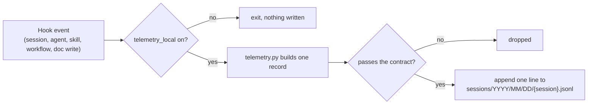

addit-harness can keep a metadata-only usage log on your own machine, so you can
see which agents, skills and `/dev-flow` steps you actually use and how they end.
It is **off by default**, it is **never sent anywhere** by the plugin, and you can
read or delete every file. The [privacy policy](../../privacy/#optional-local-telemetry-off-by-default)
is the binding description; this page explains how it works.

<div class="docs-toc" markdown="1">
**On this page**
- [Turn it on or off](#turn-it-on-or-off)
- [What is recorded](#what-is-recorded)
- [What is never recorded](#what-is-never-recorded)
- [Where it lives](#where-it-lives)
- [Export a summary](#export-a-summary)
- [Optional publish to claude.ai](#optional-publish-to-claudeai)
- [Cost](#cost)
</div>

## Turn it on or off

Open `/config` and switch on the addit-harness option **Local telemetry**
(`telemetry_local`, declared in the plugin's `userConfig`, default `false`). Switch
it off the same way. While it is off, every telemetry hook exits immediately
without starting Python and nothing is written.



## What is recorded

Every record is checked against `hooks/telemetry-contract.json` (schema 2.2) before
it is written. The contract has no free-text field: a value is an enum member, a
name from the plugin's own inventory, a count, a boolean, a timestamp, an id that
Claude Code assigned, or a hash. A record that does not fit is dropped.

- Which addit-harness agents, skills, commands and `/dev-flow` workflows ran, and
  how they ended. Agent names outside addit-harness are recorded as "other"
  (except `pr-review-toolkit:code-reviewer`, which `/dev-flow` uses).
- Gate verdicts: triage, intake brief, design review, plan approval, code review,
  QA, and the frontend FC-1 line-cap hook's findings.
- Counts and sizes: characters of an agent's final report; size, lines, mermaid
  blocks and evidence labels of Markdown documents written under a `docs/` folder;
  and the document kind (plan, solution, report and so on).
- The names and sizes of the standard instruction files (`CLAUDE.md`, `AGENTS.md`)
  and of the plugin's own rules when they load, and the setup sync state.
- Timestamps, and the session, agent and workflow-run ids Claude Code assigns.
- Salted hashes (truncated SHA-256) of your project folder path, of document paths
  under `docs/`, and of `/dev-flow` work-item names. The salt is a random value
  stored only in the log folder. These hashes are **pseudonymous, not anonymous**:
  anyone holding both the log and the salt can test a guess against them.

## What is never recorded

Prompts, responses, code, file contents, the names or paths of your files and
folders, command lines, error text, branch or repository names, and account, email
or organisation details. To count lines and diagrams, the hook reads Markdown files
written under `docs/` and keeps only the numbers.

## Where it lives

One folder, the plugin's data folder in Claude Code:
`~/.claude/plugins/data/<plugin-id>/telemetry/`.

- `sessions/YYYY/MM/DD/<session-id>.jsonl`: one JSON line per event.
- `state/`: the salt and small per-session bookkeeping files.
- `export/<timestamp>/`: anything you export (below).
- `README.md`: a plain-text note on what the folder is and how to delete it.

Day folders older than 90 days are deleted when a session starts, and the oldest
days are deleted first if the folder grows past 100 MB. To delete everything now,
switch the option off and remove the folder.

The same plugin data folder, outside `telemetry/`, also holds one file that is not
telemetry and is created whether the option is on or off: the empty one-time
welcome marker `onboarding/welcome-v1` (see
[Getting started](../getting-started/#first-run)). It holds nothing and is never
read by the exporter.

## Export a summary

```
/addit-harness:telemetry-export [--days N]
```

You run this yourself; Claude cannot invoke it on its own. It reads the last `N`
days (default 30), re-validates every line, and writes two files to
`export/<timestamp>/` in the log folder:

- `data.json`: KPIs plus one row per session (hashed session id, day, duration,
  agents, outcomes, workflows, document writes, FC-1 hits). Lines that fail
  validation are skipped and counted in `invalid_lines`.
- `report.html`: the same data as a page that opens offline in any browser. It
  loads no external scripts, fonts or images.

KPIs include the share of shipped agents and rules actually used, the agent
completion rate, the share of designed work items that were implemented, the share
re-designed at a higher tier, plan-approval passes before implementation, plans and
solutions within the `deep` length ceiling, in-place revisions, solution docs that
list candidates before your idea, and frontend runs without an FC-1 hit. A KPI the
log cannot compute shows `n/a` with the reason (for example, token cost and latency
are left to Claude Code's own OpenTelemetry export). With no log yet, every KPI
reads `n/a`.

## Optional publish to claude.ai

After the local export, the command asks whether to publish the **aggregated** KPIs
(no per-session rows, ids or hashes) as a private Artifact on claude.ai. Only an
explicit "yes" in that run publishes; the answer is not remembered. The upload goes
to Anthropic's hosted service under your account through Claude Code's own Artifact
tool, not through a connection the plugin opens, and that page is governed by
Anthropic's terms. If the Artifact tool is not available to you (for example with
an API-key, Bedrock or Vertex login), nothing is published and the local path of
`artifact.html` is printed instead.

## Cost

With the option on, each hook event costs roughly 41 ms at the median and 55 ms at
the 90th percentile in local measurements; it varies with your machine. The
telemetry hooks fail open (any error exits quietly) and all but the session-end hook
have a 5-second timeout, so a telemetry problem does not block your session.
With the option off, a small shell launcher exits before any Python starts.

## Next

- [Privacy Policy](../../privacy/) — the binding description of what the plugin does with data.
- [Skills & commands](../skills-commands/) — every command the plugin adds.
