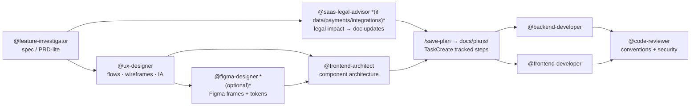

Concrete workflows showing which configs fire together. On GitHub the
diagram below renders as a mermaid flowchart; on this site it's shown as
plain text for reference.

## Build a new feature



1. `@feature-investigator` → requirements/scope (spec/PRD-lite) before any code.
2. `@saas-legal-advisor` *(if the feature touches user data, payments,
   third-party integrations, or account types)* → runs in parallel with UX
   design; produces an impact table (Critical/Important/Advisory) and drafts
   updated legal clauses. Saves the assessment to `docs/legal/`. Legal doc
   updates ship before or with the feature — not after.
3. `@ux-designer` → user flows, journey map, IA, wireframes, state matrix,
   and interaction specs. Reads `.claude/design-conventions.md`; flags
   design-system gaps for `@frontend-architect`. Saves the spec to
   `docs/solutions/`.
4. `@figma-designer` *(optional)* → materializes the UX spec into Figma
   frames, components, auto-layout, and tokens via the official Figma MCP.
5. `@frontend-architect` → component/rendering/state architecture informed
   by the UX spec; resolves any design-system gaps flagged upstream.
6. Plan it — a diagram-rich plan (mermaid), then `/save-plan` →
   `docs/plans/`. TaskCreate a tracked task list from the plan's phased
   steps so status is visible; TaskUpdate each task as it completes.
7. Implement — `@backend-developer` and/or `@frontend-developer` write +
   verify the code; Tier-1 `rules/<lang>.md` auto-load per file type.
8. `@code-reviewer` → checks correctness, security, *and* adherence to the
   vendored conventions (file:line violations).

## Review or debug existing code

- `@code-reviewer` on a diff — flags convention violations with file:line.
- `@debugger` for a failing test or stack trace — isolates root cause.

## Design or implement infrastructure

- `@cloud-architect` for up-front design (new environment, migration,
  multi-cloud strategy) → design doc saved to `docs/solutions/`.
- `@cloud-architect` to **audit existing infrastructure** (cost, security,
  reliability, IaC drift) → review report saved to
  `docs/architecture-reports/` with Critical/Important/Advisory findings.
- `@devops-engineer` implements the design or acts on the review's findings
  — Terraform/Kubernetes manifests, Dockerfiles, CI config, edge security
  (Cloudflare WAF/DDoS/Zero Trust or the hyperscaler-native equivalent), and
  vulnerability/IaC/secrets scanning per the design.
- Both prefer the AWS/Azure/DigitalOcean/Terraform/Kubernetes/Docker/
  Cloudflare MCP servers when connected (see [Enabling MCP](../mcp/)),
  falling back to the provider CLI otherwise. Google Cloud has no unified
  official MCP server yet, so GCP work falls back to `gcloud` directly.

## Make an architecture decision

- `@backend-architect` (API/service) or `@frontend-architect`
  (component/rendering/state) produce a design doc → saved to
  `docs/solutions/<date>-<slug>.md`.
- `@architect-reviewer` evaluates an existing design → saved to
  `docs/architecture-reports/<date>-<slug>.md`.
- Record the decision with `/adr` (MADR) under `docs/adr/`.

## Assess legal impact before shipping a feature

Before a feature that touches user data, payments, or third-party services
ships, invoke `@saas-legal-advisor` with the feature description or PR diff.
It produces an impact table (Critical / Important / Advisory) mapping each
change to the specific legal document and clause affected, then drafts the
updated clause(s). Output saves to `docs/legal/<date>-<slug>.md` — update the
live documents before or alongside the feature, never after.

```
@saas-legal-advisor "We're adding Stripe Connect, storing payment method
tokens, and sending transactional emails via Resend — what needs to change
in our legal docs?"
```

## Review or draft legal documents

- Audit: `@saas-legal-advisor "Audit our Privacy Policy against current GDPR requirements"`
- Draft: `@saas-legal-advisor "Write a Data Processing Agreement for enterprise customers"`
- The agent reads the project's `CLAUDE.md` for the declared primary
  jurisdiction and applies that framework first. Add secondary
  jurisdictions (e.g. GDPR for EU users) in your request or in `CLAUDE.md`.

## New third-party integration

Any new SDK, API, or analytics tool is a legal event — it introduces a new
data processor and may require cookie consent, privacy policy updates, or
DPA amendments. Ask `@saas-legal-advisor` with the integration name before
the code ships.

## Day-to-day coding in Go / Java / TS

Just open the file — language conventions auto-apply (Tier 1) and the
reviewer enforces them; no command needed. Claude pulls deeper `references/`
only for substantial work.

## Keep costs down

Default `opusplan` (Opus plans, Sonnet executes); `/model` to switch,
`/effort low` for simple tasks, and delegate noisy work to subagents. See
[Model & cost](../model-cost/).

## Review pull requests on GitHub (subscription-only, no API key)

Two paths — both work on Pro/Max, no `ANTHROPIC_API_KEY` needed:

| Path | Setup | When to use |
|------|-------|-------------|
| **Local on-demand** | None — just be logged in | Quick reviews before a push, or when CI isn't set up |
| **Automated CI** | `claude setup-token` → add secret → copy workflow | Every PR auto-reviewed on open/push |

*Local (works right now):*

```
/code-review #<pr-number> --comment
```

Uses your `/login` subscription credentials. Posts inline comments on the PR
diff via the GitHub MCP server. No secret or token needed.

*Automated CI:* see
[`addit-digital/addit-actions`](https://github.com/addit-digital/addit-actions)
— a reusable `workflow_call` workflow. Copy the caller into any app repo's
`.github/workflows/`, add `CLAUDE_CODE_OAUTH_TOKEN` as a repo secret
(`claude setup-token` → `gh secret set`), and Claude reviews every PR
automatically.

> **Caveats:** CI runs consume your Pro/Max quota. The OAuth token
> (`setup-token`) lasts ~1 year.

## Connect Jira / a database

Enable the relevant server from `mcp.example.json`. See
[Enabling MCP](../mcp/).

## Set up a specific repo

Copy `templates/CLAUDE.project.md` → the repo's `./CLAUDE.md` for
codebase-specific facts (keep them out of global memory).

## Next

- [Subagents](../subagents/) — full descriptions of every agent used above.
- [Extending](../extending/) — add a new rule, subagent, or command.
