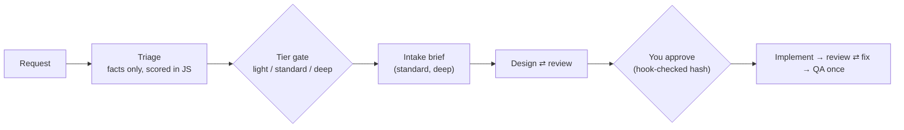

A summary of the changes not yet released. The full list is the `Unreleased`
section of the [Changelog](../changelog/). No version number is assigned yet.

## Breaking changes

| Change | What to do |
|---|---|
| `install.sh`, `sync_tools.py` and `tools.config.json` are removed; only Claude Code is supported | Install the plugin and run `/addit-harness:setup`. See [Migrating from `install.sh`](../getting-started/#migrating-from-installsh) |
| `@addit-harness:feature-investigator` is now `@addit-harness:product-owner` | Use the new name. It describes the problem only and never proposes a solution |

## `/dev-flow` scales with the task

- **Triage and tiers.** A read-only `@task-triager` reports facts; a script scores
  them into `light`, `standard` or `deep`, and you confirm or change the tier. Worst-
  case agent calls per whole run are 18, 46 and 50 (hard caps, mock-asserted, not
  measured live).
- **Intake.** At `standard` and `deep`, `@product-owner` asks only questions that
  change the approach and writes a one-page brief.
- **Better designs.** Architects compare at least three candidates, including an
  unconventional one, with prior art and a pre-mortem; your own idea is scored only at
  the end. At `deep`, three explorers work in parallel.
- **A real approval gate.** A hook refuses to start implementation unless the plan
  carries your approval marker and is unchanged since. ADRs are written after you
  approve.
- **Calmer failure handling.** One failed agent call is logged instead of ending the
  run, the final review judges the code after the last fix, QA runs once, and a
  `light` run that turns out bigger than predicted stops and re-gates at `standard`.

Details: [How dev-flow works](../dev-flow/), and the
[example workflow](../example-workflow/) for one run end to end.

## Agents and conventions

- Every agent has an explicit `tools:` list. For the four architect and design
  agents, first-turn context fell from about 33k to about 17k tokens in a controlled
  probe. See [Subagents](../subagents/#tools-per-agent).
- Frontend code has a contract, FC-1..FC-10, with an advisory line-count hook
  (ESLint opt-in via `ADDIT_FE_GATE=eslint`). See
  [Concepts](../concepts/#frontend-implementation-contract).
- Go and Java conventions are split into cited topic files with rule ids and a
  short contract (G-1..G-10, J-1..J-14).

## Documents

Plans, designs, briefs and reports follow one doc protocol: a template per type,
length ceilings per tier, Observed/Inferred/Unknown labels, edits in place, and one
diagram per concept. Plugin locations under `docs/work/<slug>/` win over a project's
own folders. See [The engineering loop](../engineering-loop/).

## Setup

`/addit-harness:setup` now merges `settings.json` instead of replacing it, unions
your permission rules with the template's, and with `--plugins` installs the
declared plugins. See [Getting started](../getting-started/#what-setup-does-to-your-settingsjson).

## Seeing where a run is

- **Progress in `/workflows`.** The dev-flow workflows log their tier, each review
  round's blocking count, every gate verdict and any halt reason, so `/workflows`
  shows the state of a run without the conversation narrating it. The lines carry
  no request text or agent output (a halt reason can include an error message or,
  for a scope breach, file paths), and the mock suite checks their format.
- **A lifecycle task list.** Setup's `settings.json` now sets
  `CLAUDE_CODE_ENABLE_TODO_TOOLS=1`, because the task tools are off by default on
  newer models, and `/dev-flow` keeps six tasks (triage to commit) current. Setup
  merges `env` key by key, so a value you set yourself wins. Not yet proven in a
  live terminal: that every task update is issued, and the context the task tools
  add per turn.

See [Watching a run](../dev-flow/#watching-a-run).

## First run

The first interactive session after install shows a one-line welcome, once,
pointing at setup or `/dev-flow` and the new `/addit-harness:tips` command. It is
shown to you, not added to the model's context, and a local empty marker file keeps
it from repeating. Setup now ends with a next-steps line. See
[Getting started](../getting-started/#first-run).

## Local telemetry and privacy

An optional usage log, off by default, records metadata only to one folder on your
machine and is never sent anywhere by the plugin. `/addit-harness:telemetry-export`
turns it into an offline report; publishing a summary to claude.ai happens only if
you say yes. The privacy policy now lists every hook that runs a script. See
[Local telemetry](../telemetry/).
