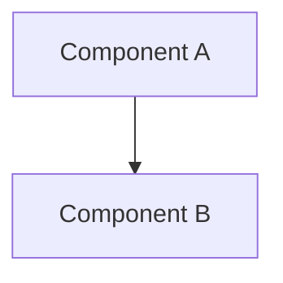

# Architecture Decision Record (ADR) — MADR format

Capture a significant architectural/technical decision as a durable, structured
record in **MADR 4.0** format (Markdown Any Decision Records), stored in version
control next to the code so future readers understand *why*, not just *what*.

Sources / further reading:
- MADR: https://adr.github.io/madr/ · https://github.com/adr/madr
- Format gallery (Nygard, MADR, etc.): https://github.com/joelparkerhenderson/architecture-decision-record
- Nygard's original: https://www.cognitect.com/blog/2011/11/15/documenting-architecture-decisions

## When to write one
ADR-worthy = **significant and hard to reverse**: technology/framework/database
choice, API or integration style, data model, architectural pattern (monolith vs
services, sync vs event-driven), security approach, or a notable trade-off. Skip
trivial, easily-reversed choices.

## Choosing minimal vs full
- **Minimal** (default): smaller/medium decisions — Context & Problem, Considered
  Options, Decision Outcome (+ Consequences).
- **Full**: weighty decisions with several real alternatives — adds Decision
  Drivers, per-option Pros and Cons, Confirmation, and More Information.
- Honor `--full`/`--minimal` if given; otherwise pick by decision weight.

## Procedure
1. **Locate/initialize the store.** Use `docs/adr/`. If it doesn't exist, create
   it and a `docs/adr/README.md` index. If the repo already has an ADR location or
   template, follow that instead. Optionally seed the meta-ADR
   `0001-record-architecture-decisions.md` (records the decision to use ADRs).
2. **Assign the next number.** Scan `docs/adr/` for the highest `NNNN`, increment;
   4-digit zero-padded starting at `0001`.
3. **Gather context.** From the conversation/code extract: the problem and why
   now, decision drivers/forces, the alternatives considered, the chosen option,
   and consequences (good and bad). Ask the user only for what you can't infer —
   especially *alternatives rejected and why*, the most valuable part.
4. **Write** `docs/adr/NNNN-kebab-case-title.md` using the matching template below.
   When the decision involves architecture or flow, embed a mermaid diagram
   (component `graph`/`flowchart` and/or `sequenceDiagram`) in *Context and Problem
   Statement* and/or per option — ADRs live as files / on GitHub, so mermaid
   renders. Skip it for non-structural decisions.
5. **Update the index** `docs/adr/README.md` with a row: number, title (link),
   status, date.
6. **Report** the path and a one-line summary. Don't commit unless asked.

## MADR — minimal template
```markdown
---
status: "proposed"
date: {YYYY-MM-DD}
decision-makers: {who decided}
---

# {short title of the decision}

## Context and Problem Statement

{2–3 sentences, or a short story; optionally phrased as a question. Link issues/
boards if relevant.}

<!-- Optional, when the decision is structural — delete if not applicable -->
## Architecture / Flow



## Considered Options

* {option 1}
* {option 2}
* {option 3}

## Decision Outcome

Chosen option: "{option 1}", because {justification — resolves the key driver /
best trade-off / only viable option}.

### Consequences

* Good, because {positive consequence}
* Bad, because {negative consequence / new cost or risk}
```

## MADR — full template
```markdown
---
status: "proposed | rejected | accepted | deprecated | superseded by ADR-NNNN"
date: {YYYY-MM-DD}
decision-makers: {who decided}
consulted: {subject-matter experts consulted (two-way)}
informed: {kept up to date (one-way)}
---

# {short title of the decision}

## Context and Problem Statement

{2–3 sentences or a short story; optionally a question. Link issues/boards.}

<!-- Optional, when the decision is structural — delete if not applicable -->
## Architecture / Flow


## Decision Drivers

* {driver 1 — a force or concern}
* {driver 2 — a force or concern}

## Considered Options

* {option 1}
* {option 2}
* {option 3}

## Decision Outcome

Chosen option: "{option 1}", because {justification}.

### Consequences

* Good, because {positive consequence}
* Bad, because {negative consequence}

### Confirmation

{How compliance with this decision will be confirmed — e.g. design/code review,
or an ArchUnit/fitness-function test.}

## Pros and Cons of the Options

### {option 1}

* Good, because {argument}
* Neutral, because {argument}
* Bad, because {argument}

### {option 2}

* Good, because {argument}
* Bad, because {argument}

## More Information

{Additional evidence, team agreement, when to revisit, links to related ADRs.}
```

## Lifecycle & superseding
- Status flow: `proposed → accepted → deprecated | superseded` (use `rejected`
  for an option/decision not taken).
- ADRs are immutable once **accepted**. To change a decision, write a **new** ADR,
  set the old one's status to `superseded by ADR-NNNN`, and cross-link both ways
  (new → what it supersedes; old → its replacement). Never silently edit an
  accepted decision's substance.

## Optional external tooling (not required)
The skill writes the markdown directly, so a CLI is usually redundant. If you
outgrow it: `npryce/adr-tools` codified the numbering/superseding conventions
(but is stale, last release 2018 — cite, don't depend); `thomvaill/log4brains`
can publish ADRs as a browsable website.
